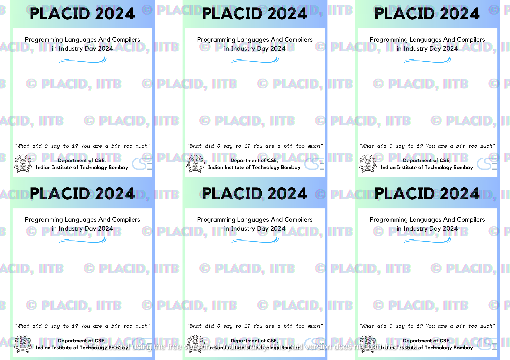

## Badger 

A very simple script, basically takes an A4 Image template, list of attendees + their affiliation and generates customized badges.
Most outputs will look good right away, for ones that are non-optimal we do some manual editing. 

### Input

-- sample/sample.png

The sample.png is expected to be 2000x1414 pixels.



-- sample/data.csv
```
Serial Number,Email,Name,Affiliation,,,
1,meeteshmehta@cse.iitb.ac.in,Meetesh Mehta,IIT Bombay,,,
2,meeteshmehta@cse.iitb.ac.in,Meetesh Mehta,IIT Bombay,,,
3,meeteshmehta@cse.iitb.ac.in,Meetesh Mehta,IIT Bombay,,,
4,meeteshmehta@cse.iitb.ac.in,Meetesh Mehta,IIT Bombay,,,
5,meeteshmehta@cse.iitb.ac.in,Meetesh Mehta,IIT Bombay,,,
6,meeteshmehta@cse.iitb.ac.in,Meetesh Mehta,IIT Bombay,,,
7,meeteshmehta@cse.iitb.ac.in,Meetesh Mehta,IIT Bombay,,,
```

**NOTE:** Ensure that the data is in multiples of 6

-- **Command**
```
python3 generate.py --out="sample-out" sample/data.csv sample/sample.png ./Kollektif-Bold.ttf
```

### Output


## Options

```
mee@mee-402:~/dev/id-card-names$ python3 generate.py -h

usage: generate.py [-h] [--out OUT] [--h-scale H_SCALE] [--v-scale V_SCALE] csv template font

PLλTO Badger, IITB

positional arguments:
  csv                path to CSV containing columns 'Name' and 'Affiliation'; all other columns will be ignored
  template           path to template file to use, see PLACID2024.png for reference (we expect to print 6 ID's in an A4 Sheet)
  font               path to the font file to use, Kollektif-Bold.ttf is a good choice...

optional arguments:
  -h, --help         show this help message and exit
  --out OUT          Path to the output folder (default='./outputs')
  --h-scale H_SCALE  Horizontal Scaling (default = 67.34006734)
  --v-scale V_SCALE  Horizontal Scaling (default = 67.333333333)
```